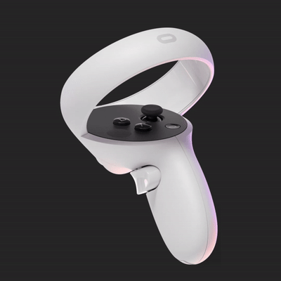

RumbleRumbleQuest
=================

Quest BeatSaber mod for altering haptic feedback behaviors. A port of the RumbleMod to the Quest.

## Settings

The preferred way is to use the in-game UI for configuration.

## Credits

* Original PC RumbleMod made by nalulululuna: [nalulululuna/RumbleMod](https://github.com/nalulululuna/RumbleMod)
* Libraries: [QuestUI](https://github.com/darknight1050/questui), [beatsaber-hook](https://github.com/sc2ad/beatsaber-hook), [codegen](https://github.com/sc2ad/BeatSaber-Quest-Codegen), [custom-types](https://github.com/sc2ad/Il2CppQuestTypePatching)
